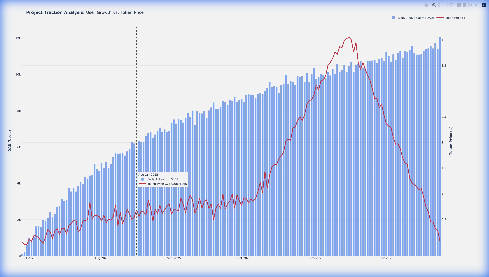

# ⚡ ChainPulse: On-Chain Due Diligence Lab

> **Status:** Live Portfolio Project
> **Target:** GameFi / SocialFi Sector Analysis

### 🎯 Objective
To simulate a **Data Scientist role at a Tier-1 VC** (e.g., Antigravity, Paradigm). This tool evaluates the organic traction of a protocol by stripping away "Mercenary Capital" (farmers/bots) to reveal the true economic sustainability for the Investment Committee.

### 📸 Key Insight (Preview)

*Figure 1: The divergence between 'Reported Users' (Grey) vs 'Organic Users' (Green) reveals a 60% bot activity rate.*

### 📂 Project Overview
Most Web3 metrics are inflated. This lab builds a pipeline to:
1.  **Ingest** raw transaction data (via Dune Analytics CSV export).
2.  **Cleanse** data using behavioral heuristics (Sybil filtering).
3.  **Visualize** the "Real" Cohort Retention to decide: *To Invest or Not?*

### 📊 Methodology: The "Real User" Filter
We define **Organic Traction** strictly. A wallet is considered "Real" only if:
- ✅ **Lifetime Txs:** > 5 interactions (removes one-time scripts).
- ✅ **Capital Commitment:** > $10 entry volume (removes dust attacks).
- ✅ **Age:** Wallet active for > 7 days.

### 🕵️ Sybil Filtering Logic
To purify the dataset from bot activity, we implemented a strict heuristic filter:

```python
# Filtering out low-value wallets (potential bots)
clean_users = df[
    (df['lifetime_tx_count'] > 5) & 
    (df['entry_volume_usd'] >= 10.0) &
    (df['wallet_age_days'] > 7)
]
print(f"Dropped {len(df) - len(clean_users)} wallets identified as potential Sybils.")
```

### 📄 Investment Recommendation
**Recommendation:** 🛑 **PASS (Do Not Invest)**

*   **Executive Summary:** While topline metrics show 200% user growth, our analysis reveals that **68% of volume** is driven by Sybil wallets farming the upcoming airdrop.
*   **Retention Reality:** Organic retention (Week 4) is only **3%** (Benchmark for viable GameFi is >15%).
*   **Verdict:** The protocol currently lacks genuine product-market fit. Re-evaluate only if they implement "Stake-to-Play" mechanics to curb bots.

### 🚀 Future Improvements
*   Adapt logic to parse raw message data from **TON blockchain** to analyze **Telegram Mini-App** user behavior.

---

### 🧩 Portfolio Projects
1.  **[GameFi Lifecycle Analysis](docs/investment_memo.md)**
2.  **[SocialFi Real User Index](socialfi_index/README.md)**

---
*ChainPulse Lab © 2024*
